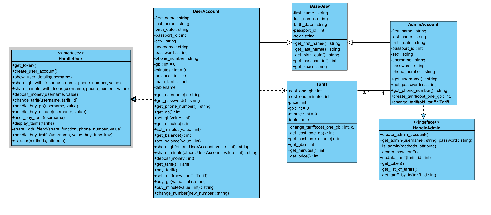
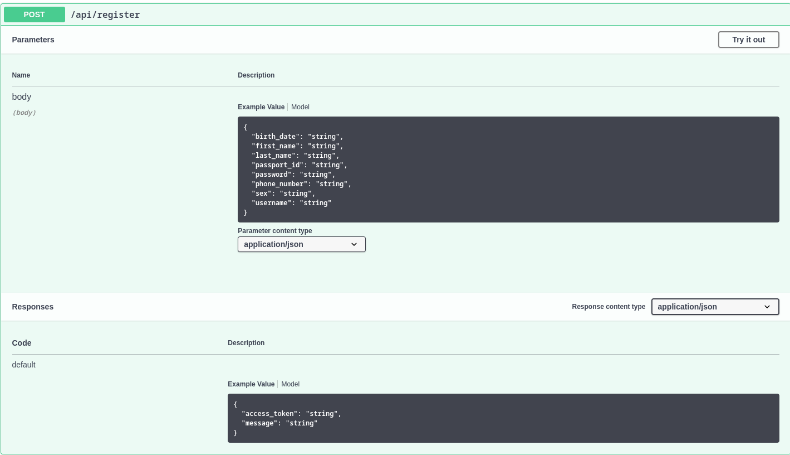
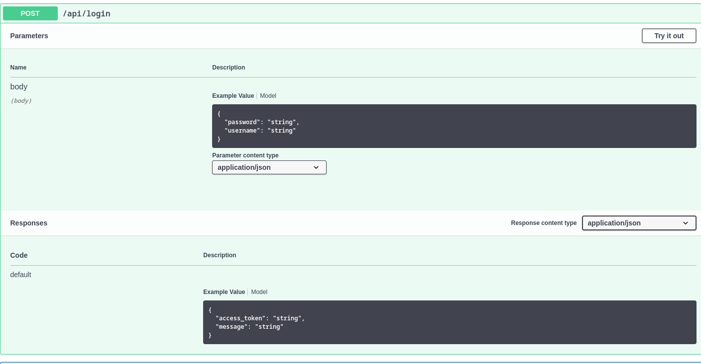
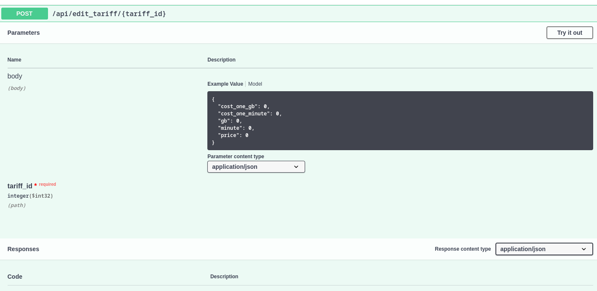
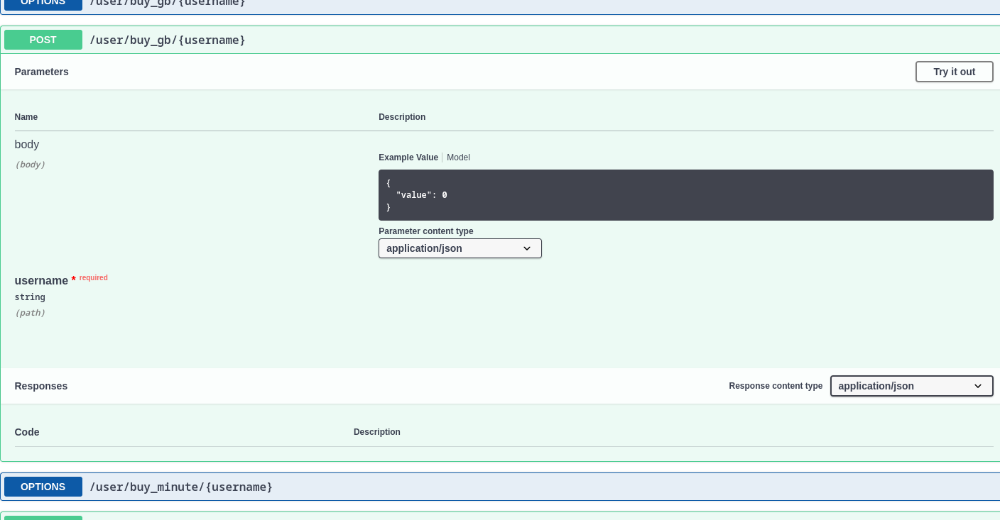
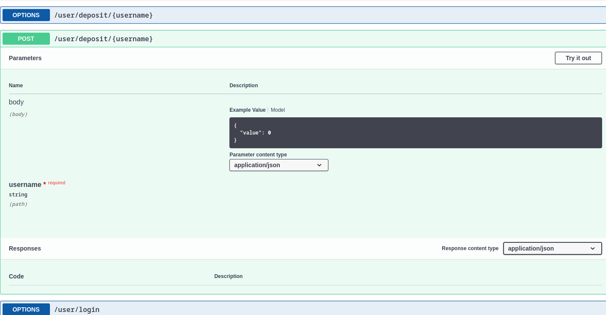
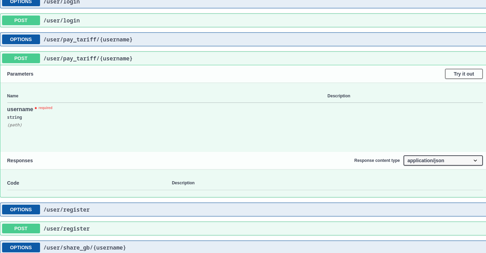
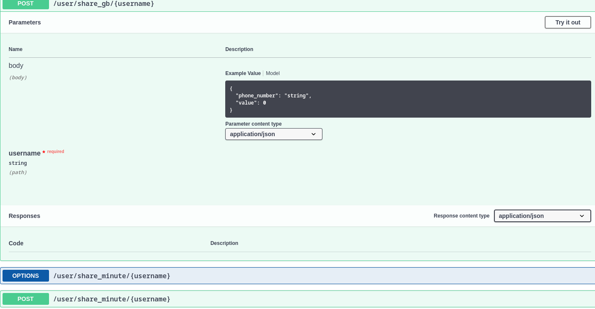
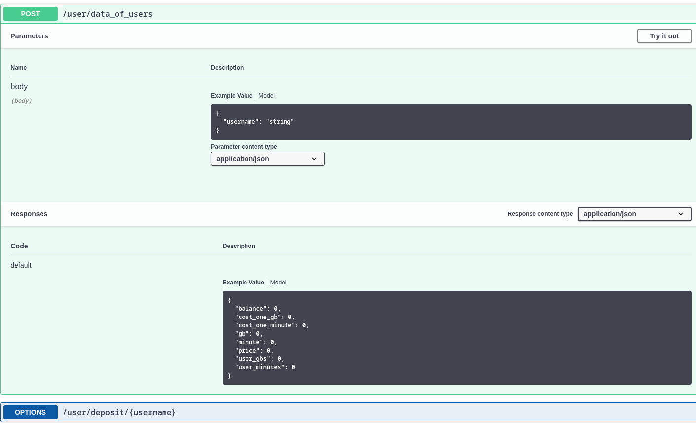

# Онлайн-приложение "VRM"
## Рахимов Ворис, Камолиддинзода Мухаммадхуджа и Дадабаев Рауфджон Б05-252
Добро пожаловать в VRM, данное приложение представляет из себя онлайн-приложение, разрабатываемое на языке Python.
Это приложение поможет вам легко управлять вашим аккаунтом VRM, проверять баланс, остаток гигабайт и минут, а также обмениваться гигабайтами и минутами с другими пользователями.
## Возможности
- **Проверка и пополнение баланса**: В приложении вы можете быстро узнать текущий остаток на вашем счету.
- **Проверка остатка минут и гигабайт**: Узнайте, сколько осталось у вас интернет-трафика и минут разговора.
- **Покупка минут и гигабайтов**: Докупайте необходимое вам количество минут и гигабайт.
- **Обмен минутами и гигабайтами**: Обменивайтесь остатками гигабайт и минут с другими пользователями VRM прямо из приложения.
- **Проверка и изменение тарифа**: Сравнивайте и выберите наиболее подходящий для себя тариф.

## Архитектура нашего проекта:

## Запуск проект
### Необходимая версия питона 
#### version - 3.12
### Создание виртуального окружение
    pip install virtualenv
    
    virtualenv myenv
    
    source myenv/bin/activate
     
    pip install -r requirements.txt

### Запуск
    cd src
    python manage.py # запуск бэкэнд сервера
    cd ..
    cd frontend
    python app.py
    

### Код доступа для админов
#### secret_key = {напишем тебе в телеге}

### API
#### Я сделал документацию для api, и напишите я скину его вам в лс

# ПРЕДУПРЕЖДЕНИЕ
- **Сначало создайте аккаунт для админа и создайте один тарифф, без него вы не сможете зарегестрироваться как пользователь(так как вы будете запускать на локальной базе данных, наши созданные тариффы вам будут не доступны)!!!**

## Описание некоторых методов нашего API.

- **По этому пути мы регистрируем нашего Админа. Мы должны получить данные представленные в скриншоте**

- **Здесь мы вводим логин и пароль, в наш фронт получает токен для запросов**

- **Этот метод позволяет изменять существующий тариф. Для этого мы должны получить данные представленные на снимке. tariff_id это номер тариффа который мы хотим изменит**

- **Благодаря этому методу, мы получаем список тарифов, мы получаем его виде списка словарей**![![]](screenshots/admin_get_list_of_tariff.png)

#### Регистратсия в вход для юзера такие же, поэтому рассмотрим другие методы.

- **Метод благодаря которому мы покупаем гб. `value` это сколько гб мы хотим купить**

- **Метод для пополнение счёта. `value` это сколько мы хотим положить на счёт**

- **Метод чтобы оплатить тариф. Как видите он ничего не принимает, т.к. мы проверяем его баланс и смотрим хватить ли у него денег для оплаты тарифа**

- **Метод для деление гб с другом. `phone_number` - номер нашего друга, `value` - это сколько мы хотим скинуть**

- **Метод для получение информации о балансе, и нашего тарифа. Когда мы нажимаем на кнопку мой профиль, нам открывается окошка, в котором мы видим сколько у нас на балансе и сколько у нас гб и минут осталось и информацию про наш тариф. Эту информацию мы получаем благодаря этому методу**

#### Остальные методы реализованы примерно так же. Для полного ознакамление могу запустить наш сервер и скинуть ссылку на документацию с хорошим графическим дизайным.

